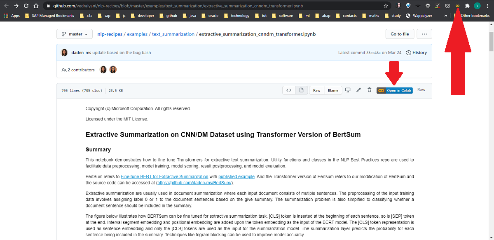
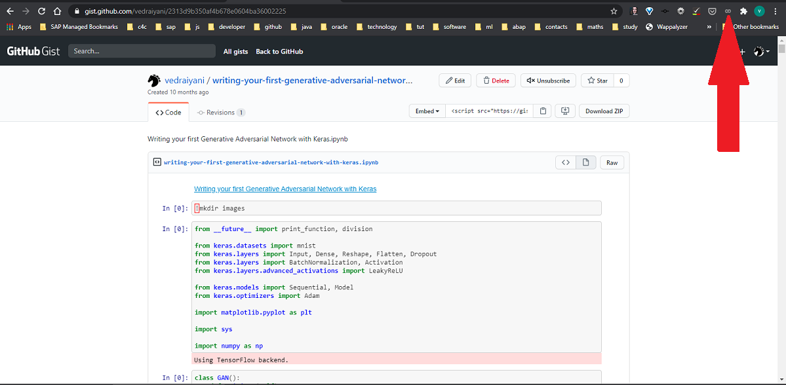

# chrome-colab-ext
If github ipython notebook page is open it will automatically add  button as shown in the image below and if extension is pinned it will be yellow as per the below image. On click of the  button, colab with given ipython notebook will be open.

If tab does't meet the above requirement it won't enable the extension and display the grayed icon if it's pinned as displayed in the image.

> ### Note:
> We haven't uploaded our extention to chrome store.

## To contribute
You can [follow](https://developer.chrome.com/extensions/getstarted):
1. Clone the repo 

2. Open the Extension Management page by navigating to 
**chrome://extensions** or goto **Chrome menu > More Tools > Extensions**.

1. Enable **Developer Mode** and Click the **LOAD UNPACKED** button and select the extension directory.

4. Select extension folder

